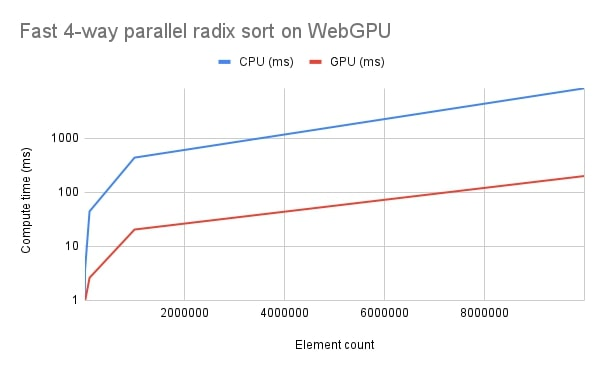

# Fast 4-way parallel radix sort for WebGPU

This is a WebGPU implementation for the radix sort algorithm as described in the paper [Fast 4-way parallel radix sorting on GPUs](https://www.sci.utah.edu/~csilva/papers/cgf.pdf).

- Sort large arrays on GPU using WGSL compute shaders
- Supports 32-bit unsigned integers (`Uint32Array`)
- Supports 32-bit unsigned floating points (`Float32Array`)
- Sort a buffer of `keys` and associated `values` at the same time. The sort is made based on the `keys` buffer.
- Supports arrays of arbitrary size

### Parallel Prefix Sum (Scan)

This algorithm relies on another widely used parallel algorithm called the prefix sum (or scan).

Thus, this repository also contains a WebGPU implementation of the method described in the following publication: [Parallel Prefix Sum (Scan) with CUDA](https://www.eecs.umich.edu/courses/eecs570/hw/parprefix.pdf).

- Includes the "Work Efficient Parallel Scan" optimization
- Recurses on itself until the input fits one workgroup
- Supports arrays of arbitrary size

## Installation
### Using npm
```bash
npm install webgpu-radix-sort
```

Then import it in your app:
```javascript
// ESM
import { RadixSortKernel } from 'webgpu-radix-sort';

// CommonJS
const { RadixSortKernel } = require('webgpu-radix-sort');
```

### Using a \<script\> tag
```html
<!-- From source -->
<script src="./dist/umd/radix-sort-umd.js"></script>
<!-- From CDN -->
<script src="https://cdn.jsdelivr.net/npm/webgpu-radix-sort@1.0.2/dist/umd/radix-sort-umd.js"></script>
<script>
    const { RadixSortKernel } = RadixSort;
</script>
```

### Using a \<script type="module"\> tag
```html
<script type="module">
    // From source
    import { RadixSortKernel } from './dist/esm/radix-sort-esm.js';
    // From CDN
    import { RadixSortKernel } from 'https://cdn.jsdelivr.net/npm/webgpu-radix-sort@1.0.2/dist/esm/radix-sort-esm.js';
</script>
```
## Usage
See example/index.js for a complete example.

```javascript
const radixSortKernel = new RadixSortKernel({
        device: device,                   // GPUDevice to use
        keys: keysBuffer,                 // GPUBuffer containing the keys to sort
        values: valuesBuffer,             // (optional) GPUBuffer containing the associated values
        count: keys.length,               // Number of elements to sort
        bit_count: 32,                    // Number of bits per element. Must be a multiple of 4 (default: 32)
        workgroup_size: { x: 16, y: 16 }, // Workgroup size in x and y dimensions. (x * y) must be a power of two
})

...

// Sort keysBuffer and valuesBuffer in-place on the GPU
const pass = encoder.beginComputePass()
radixSortKernel.dispatch(pass)
```

### Current limitations

- Sort in ascending order
- Only supports unsigned values
- `bit_count` must be a multiple of 4
- `workgroup_size.x * workgroup_size.y` must be a power of two

### Maximum number of elements

The maximum number of elements that can be processed is not bound by the implementation itself but by WebGPU limits, which can be increased when creating the GPUDevice. 

If you encounter warnings when creating or dispatching the radix sort kernel, try increasing the relevant limits:
- `maxBufferSize` (default: 268,435,456, limiting the number of elements to 67,108,864)
- `maxStorageBufferBindingSize` (default: 134,217,728, limiting the number of elements to 33,554,432)

You should also take the following limits into consideration when choosing the `workgroup_size` parameter:

- `maxComputeWorkgroupSizeX` (default: 256) ⟺ workgroup_size.x
- `maxComputeWorkgroupSizeY` (default: 256) ⟺ workgroup_size.y
- `maxComputeInvocationsPerWorkgroup` (default: 256) ⟺ workgroup_size.x * workgroup_size.y

## Performance Tests

I've made a minimal web demo on which you can run the algorithm locally: https://kishimisu.github.io/WebGPU-Radix-Sort/

The following tests were done on a laptop using an Intel Core i9 @ 2.90GHz (CPU) and a NVIDIA RTX 3080TI (GPU). The vertical axis is logarithmic.



## Implementation detalis

### 1) Fast 4-way parallel radix sort

#### Local shuffling and coalesced mapping

In the original paper, a section describes how the data is locally shuffled (sorted) within the workgroups before computing the prefix block sum. This is done in order to address the issue of non-coalseced writing on the global memory.
By sorting the input data locally, it improves the memory read/write patterns during the final reordering step, resulting in a 36% performance increase in the original paper.
However, adding this process to my WebGPU implementation didn't seem to have such an impact on the performance. This can be explained by the fact that this paper was designed for an old version of CUDA (2009) and graphics card architectures have evolved since, being more optimized "out of the box" today.
For this reason, this process is disabled by default, but it can be enabled with the parameter `local_shuffle`.

#### Order checking

To improve performance in cases where the input data is already sorted or nearly sorted, the original paper describes a method that will initially scan the input array before each pass of the algorithm. In the case where the input array is sorted, the algorithm will exit early and prevent unecessary calculations. This can be useful if the data is sorted every frame with few changes between each frame for instance.

In WebGPU however, this check is not as easy to achieve while keeping optimal performances, mainly because every pass and their attributes needs to be encoded prior to being sent to the GPU, without a way to conditionally choose to stop the execution from the GPU.

I've made some tests with a custom `CheckSortKernel` that would do a parallel reduction on the input array to check if it is sorted or not and store the result in a GPU buffer. This way I could use the `dispatchWorkgroupsIndirect` method to dynamically change the number of workgroups that are created for the other pipelines of the algorithm.
However, I observed a strong negative impact on the performance and it didn't seem to improve already-sorted arrays that much so I preferred not to include it until I find a more optimized way to do it.

### 2) Parallel Prefix Sum with CUDA

#### Avoiding Bank Conflicts

In the original publication, the final version of the algorithm contains an optimization that aims at improving shared memory access patterns in order to reduce bank conflicts. 
Bank conflicts happen when multiple threads are accessing the same memory bank at the same time, resulting in slower sequential processing.
To fix this issue, the authors introduced a macro that offsets every shared memory access within their algorithm in a clever way such that the bank conflics are minimized.
Similar to the above note on `Local shuffling and coalesced mapping`, this algorithm was designed for 2007-ish versions of CUDA and adding it to my WebGPU implementation didn't seem to have an impact on the performance.
It's disabled by default but can be enabled using the `avoid_bank_conflicts` parameter.

## Project structure

```
.
├── index.html                          # Demo page for performance profiling
├── example
│   ├── index.js                        # Entry point and example usage
│   ├── tests.js                        # Utilities for profiling and testing
│
├── dist                                # Build output
│   ├── cjs                             # CommonJS build
│   ├── esm                             # ES Module build
│   ├── umd                             # UMD build (Universal Module Definition)
│
├── src                                 # Source code
│   ├── RadixSortKernel.js              # 4-way Radix Sort kernel definition
│   ├── PrefixSumKernel.js              # Parallel Prefix Sum kernel definition
│   │   
│   ├── shaders                         # WGSL shader sources as javascript strings
│       ├── radix_sort.js               # Compute local prefix sums and block sums
│       ├── radix_sort_reorder.js       # Reorder data to sorted position
│       ├── prefix_sum.js               # Parallel Prefix Sum (scan) algorithm   
│       │
│       ├── optimizations               # Contains shaders including optimizations (see "Implementation" section)
│           ├── radix_sort_local_shuffle.js
│           ├── prefix_sum_no_bank_conflict.js      
```

## References

- [Fast 4-way parallel radix sorting on GPUs](https://www.sci.utah.edu/~csilva/papers/cgf.pdf)
- [Parallel Prefix Sum (Scan) with CUDA](https://www.eecs.umich.edu/courses/eecs570/hw/parprefix.pdf)